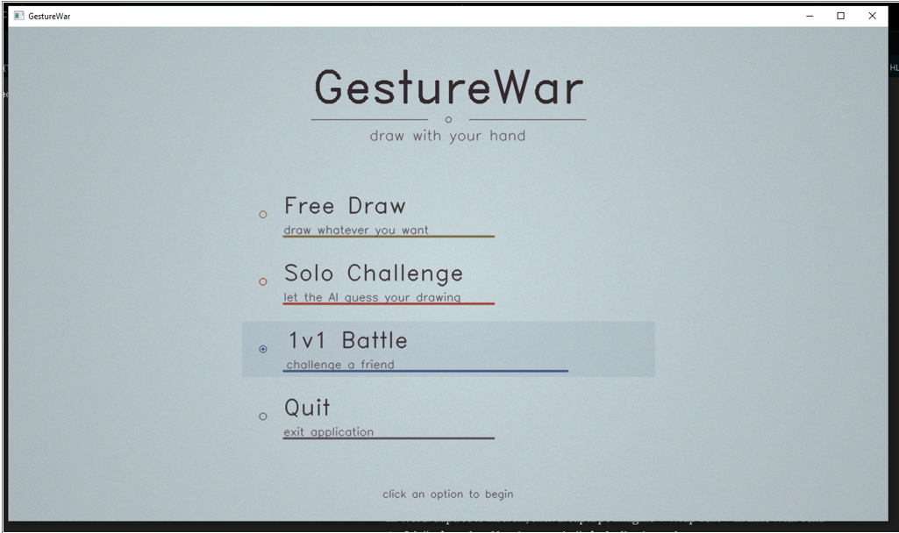
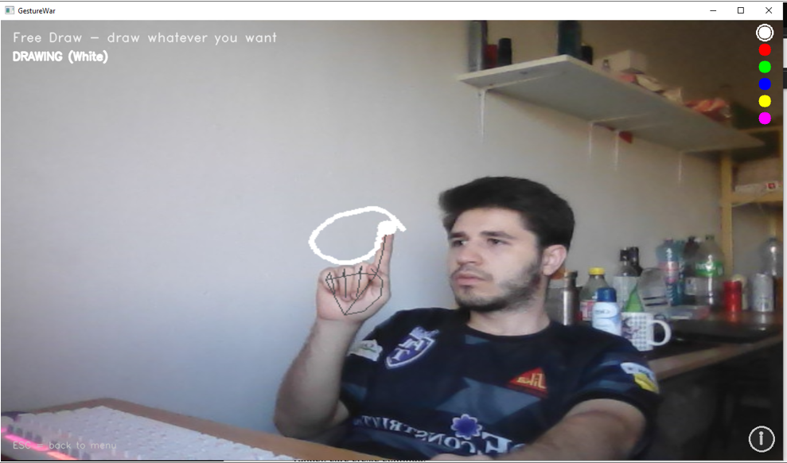
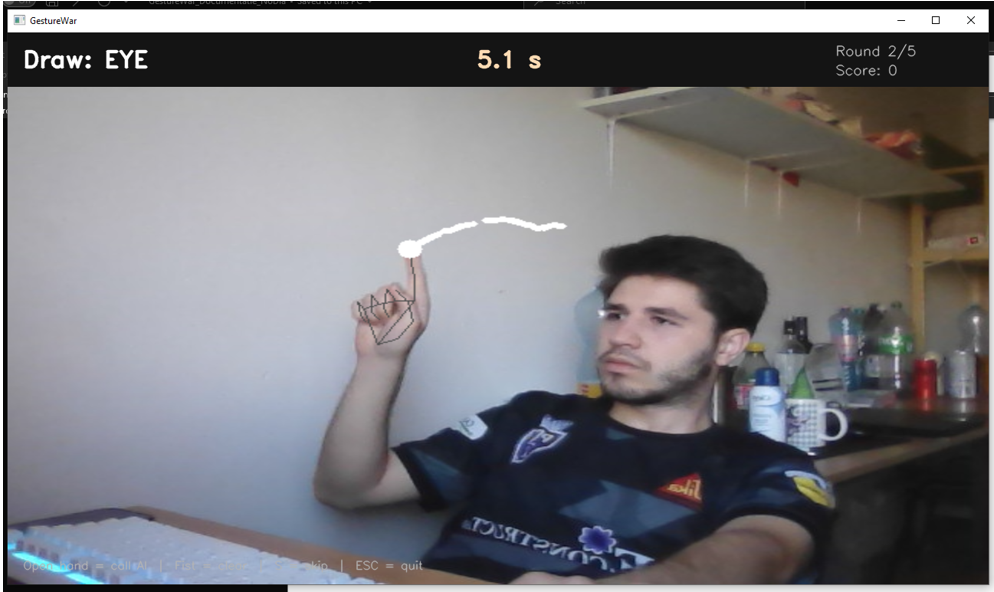
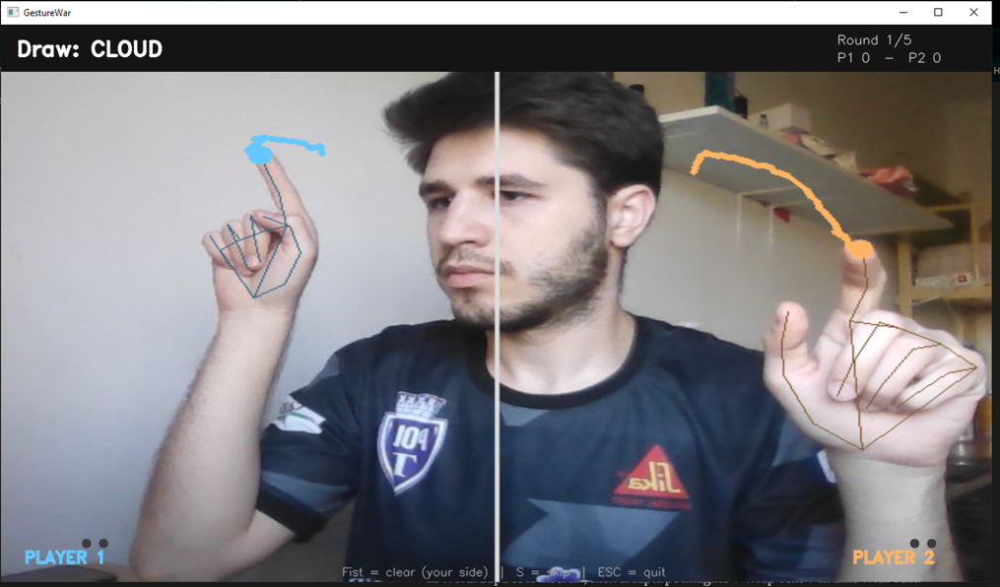

<div align="center">

# GestureWar

**Draw in mid-air with your finger. Let an AI guess what you're drawing. Battle a friend.**

[](https://www.python.org/)
[](https://www.tensorflow.org/)
[](https://opencv.org/)
[](https://developers.google.com/mediapipe)
[](https://opensource.org/licenses/MIT)
[]()

A real-time hand gesture drawing application powered by MediaPipe hand tracking and a CNN trained on Google's Quick, Draw! dataset. Draw with just your index finger in front of your webcam - no mouse, no touchscreen.

</div>

---

## Demo

<div align="center">


</div>

---

## Features

**Free Draw** - paint freely with your fingertip, switch between 6 colors with an open-hand gesture, clear the canvas with a fist.

**Solo Challenge** - the app picks a random word from 30 categories (star, cat, house, etc.); draw it as fast as you can, then call the AI with an open hand to have it guess. Faster guesses = more points.

**1v1 Battle** - split-screen mode for two players in front of the same camera. Both draw the same word simultaneously; the first one whose drawing the AI recognizes wins the round. Best of 5.

---

## Screenshots

<table>
  <tr>
    <td align="center">
      <br>
      <em>Main menu</em>
    </td>
    <td align="center">
      <br>
      <em>Free Draw mode</em>
    </td>
  </tr>
  <tr>
    <td align="center">
      <br>
      <em>Solo Challenge</em>
    </td>
    <td align="center">
      <br>
      <em>1v1 Battle</em>
    </td>
  </tr>
</table>

---

## Tech Stack

| Component | Technology |
|---|---|
| Hand tracking | [MediaPipe Hand Landmarker](https://developers.google.com/mediapipe/solutions/vision/hand_landmarker) (21-point hand model) |
| Drawing classifier | TensorFlow / Keras CNN (~600K params, 92.6% test accuracy) |
| Training dataset | [Google Quick, Draw!](https://github.com/googlecreativelab/quickdraw-dataset) (30 categories × 2000 samples) |
| Image processing | OpenCV |
| Language | Python 3.11 |

---

## Getting Started

### Prerequisites

- Python 3.11
- A working webcam
- Windows (tested on Windows 10/11; Linux/macOS should work but untested)

### Installation

```bash
# Clone the repo
git clone https://github.com/CristianIonut7/gesture-draw.git
cd gesture-draw

# Create and activate a virtual environment
python -m venv venv
.\venv\Scripts\Activate.ps1   # Windows PowerShell
# source venv/bin/activate    # Linux/macOS

# Install dependencies
pip install -r requirements.txt
```

### Running

You need a trained CNN model in `models/quickdraw_model.h5`. Either:

**Option A - train it yourself** (~1 hour on CPU):
```bash
python train_model.py
```

**Option B - download the pre-trained model:
> Place `quickdraw_model.h5` from realeses in the `models/` folder.

Then launch the app:
```bash
python main.py
```

The MediaPipe hand-tracking model (~25 MB) is downloaded automatically on first run.

---

## How to Play

### Gestures

| Gesture | Action |
|:---:|---|
| ☝️ Index finger up | Draw |
| 🤏 Pinch (thumb + index) | Pen up (stop drawing) |
| 🖐️ Open hand (~0.5s) | Change color *(Free Draw)* / Call AI *(Solo)* |
| ✊ Fist (~0.5s) | Clear canvas |

### Solo Challenge - Scoring

- **Base score:** starts at 100, decays by 2.7 per second (min 20)
- **Penalties:** wrong AI guesses cost 5, 10, 15... points (escalating)
- **Cooldown:** AI is locked for 7 seconds after a wrong guess
- **Banned guesses:** wrong predictions are excluded from the next call

### 1v1 Battle - Match Logic

- The AI evaluates both canvases every 1.2 seconds
- A player wins the round if their target word appears with confidence:
  - **\>50%** in 1st position, or **\>25%** in 2nd, or **\>15%** in 3rd
- Two consecutive matches are required to win (avoids lucky one-frame matches)
- Tie-breaker: higher confidence on the target word wins

---

## How It Works

```
Camera frame  →  MediaPipe (21 landmarks)  →  Gesture detection
                                                    ↓
            Index finger position  →  Draws on virtual canvas
                                                    ↓
                  On AI call: crop → resize 64x64 → CNN
                                                    ↓
                              Top-3 predictions with confidence
```

The application is split into independent modules with clean separation between game logic, camera/input, and UI rendering. See the [project documentation](docs/) for architecture diagrams and implementation details.

### CNN Architecture

The classifier is a VGG-style CNN with 3 convolutional blocks (32→64→128 filters), max pooling between blocks, and a dense head with 256 neurons + 30-way softmax output. Trained for 15 epochs with Adam optimizer; reached **92.61% accuracy** on the test set.

---

## Project Structure

```
gesture-draw/
├── main.py                  # Entry point, menu loop
├── train_model.py           # CNN training script (run once)
├── assets/
│   └── words.json           # 30 game categories
├── models/
│   ├── quickdraw_model.h5   # Trained CNN (created by train_model.py)
│   ├── labels.json          # Category names
│   └── hand_landmarker.task # MediaPipe model (auto-downloaded)
└── src/
    ├── canvas.py            # Single-hand canvas + MediaPipe wrapper
    ├── duel_canvas.py       # Two-hand split-screen canvas
    ├── classifier.py        # CNN inference wrapper
    ├── game.py              # Pure game logic (scoring, rounds)
    ├── modes.py             # Free Draw, Solo, Duel implementations
    └── ui.py                # Vintage paper menu & fade transitions
```

---

## Performance Notes

The 1v1 mode is computationally heavy (two hands tracked + two CNN inferences). To hit 24-30 FPS on a mid-range CPU laptop, three optimizations are applied:

- **Frame-skip MediaPipe** - hand detection runs every other frame, the previous result is reused on the off frames (~50% MediaPipe load reduction).
- **Optimized compositing** - the canvas is overlaid using NumPy boolean masking instead of multiple `cv2.bitwise_and` calls (~13ms saved per frame).
- **Threaded AI inference** - the classifier runs on a daemon thread so a 100-150ms inference doesn't block rendering.

---

## Known Limitations

- The CNN was trained on mouse/touchscreen drawings, but our gestures produce slightly different stroke patterns — accuracy in real use is below the 92% headline number.
- Requires good ambient lighting; MediaPipe struggles in dim rooms.
- Two hands very close together in 1v1 mode may be incorrectly attributed.
- On battery, Windows power management can drop FPS by ~25%.

---

## Acknowledgments

- **[Quick, Draw!](https://quickdraw.withgoogle.com/data)** by Google Creative Lab — the dataset that made the classifier possible
- **[MediaPipe](https://developers.google.com/mediapipe)** by Google Research — for the excellent hand-tracking model
- **[OpenCV](https://opencv.org/)** — for everything image-related

---

## License

Released under the [MIT License](LICENSE) — feel free to fork, modify, and use in your own projects.
