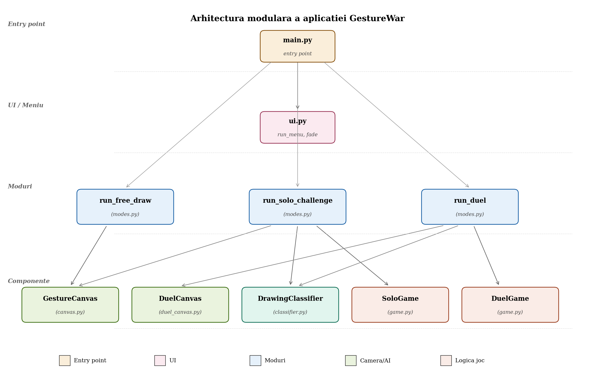
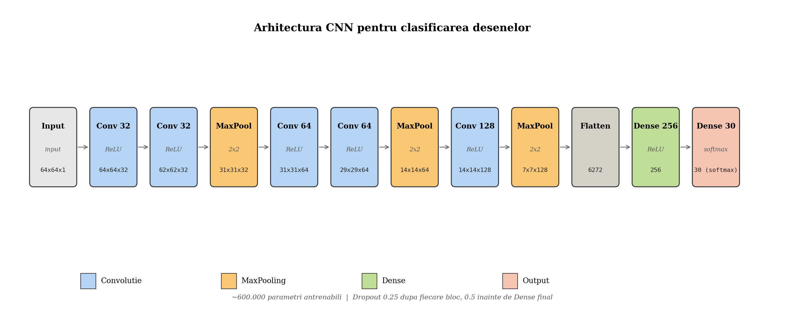
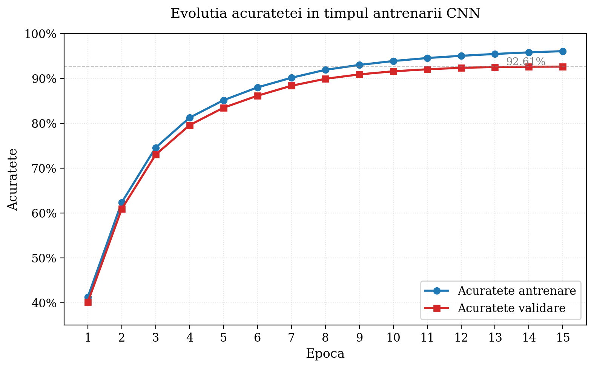

# Architecture

This document describes the internal architecture of GestureWar - how the modules fit together, key design decisions, and the data flow at runtime.

For a higher-level overview see the [README](../README.md).

---

## Overview

GestureWar is organized in **four layers**, each with a clear responsibility:



| Layer | Responsibility | Files |
|---|---|---|
| Entry point | Application bootstrap, top-level loop | `main.py` |
| UI / Menu | Vintage paper menu, fade transitions | `src/ui.py` |
| Game modes | The three play modes (Free Draw, Solo, Duel) | `src/modes.py` |
| Components | Camera, gesture detection, AI, game state | `src/canvas.py`, `src/duel_canvas.py`, `src/classifier.py`, `src/game.py` |

The key principle is **separation of concerns**: pure game logic (in `game.py`) knows nothing about cameras or pixels; UI rendering (in `ui.py`) knows nothing about gameplay; mode files orchestrate the rest.

---

## Module Reference

### `main.py` - Entry Point

The main loop runs forever:
1. Render the menu, wait for a click
2. Run the chosen mode
3. Fade back to the menu

It owns a single shared `GestureCanvas` instance which is lazily initialized on the first mode that needs it. This avoids opening the camera at startup (which would slow down launch by 1-2 seconds).

### `src/ui.py` - Menu and Transitions

Renders the main menu using OpenCV primitives on a procedurally-generated paper background (cream base + pixel noise + radial vignette). The menu uses linear interpolation with cubic easing for hover animations.

Provides `fade_in()` and `fade_out()` helpers for transitions between screens - both work by multiplying the displayed frame by a varying alpha.

### `src/canvas.py` - Single-Hand Drawing

Wraps the camera (`cv2.VideoCapture`) and MediaPipe Hand Landmarker to provide a unified `update()` method that:
- Reads a frame from the webcam
- Detects hand landmarks (21 points)
- Recognizes gestures from landmark geometry
- Updates a virtual canvas with the index finger trail
- Composites the canvas over the camera feed for display

Gestures are detected by simple geometric rules over the 21 hand landmarks:

| Gesture | Detection rule |
|---|---|
| Fist | All four fingertips below their MCP joints |
| Open hand | All fingertips above PIP joints + thumb-index distance > 0.1 |
| Pinch | Thumb-index distance < 0.07 |
| Drawing | Default state when none of the above |

Long-hold gestures (open hand, fist) require ~15-20 frames of consistent detection to trigger, preventing accidental activation.

### `src/duel_canvas.py` - Two-Hand Drawing

Variant of `canvas.py` for the 1v1 mode. Detects up to 2 hands simultaneously and assigns each to a player based on horizontal position (`avg_x < 0.5` → Player 1, else Player 2). Each player gets an independent canvas drawn on its own half of the screen.

Includes performance optimizations not needed in single-hand mode:
- MediaPipe runs every other frame (results reused on odd frames)
- Compositing uses NumPy boolean indexing instead of OpenCV mask operations

### `src/classifier.py` - CNN Inference Wrapper

Loads the trained TensorFlow model (`models/quickdraw_model.h5`) and provides a `predict()` method.

Before running inference, the canvas is preprocessed:
1. Convert to grayscale if needed
2. Skip if mostly empty (fewer than 50 non-zero pixels)
3. Find the bounding box of all drawn pixels and crop to it (with 20px padding)
4. Pad to a square (preserves aspect ratio)
5. Resize to 64×64 (the model's input size)
6. Normalize pixel values to [0, 1]

Returns the top-K predictions sorted by confidence.

### `src/game.py` - Pure Game Logic

Two classes: `SoloGame` and `DuelGame`. Both manage round state, word selection, and scoring **completely independent of UI or camera**. This means they can be unit-tested without any I/O dependencies.

Key functions:
- `calculate_score(time_seconds, penalty)` — `max(20, 100 - 2.7 × time) - penalty`
- `get_penalty_for_attempt(n)` - escalating penalty: 5, 10, 15, ...
- `check_word_match(predictions, target_word)` - lax matching used in 1v1 (top-3 with thresholds 0.50 / 0.25 / 0.15)

### `src/modes.py` - Game Modes

The largest file (~800 lines). Each mode is implemented as a function that takes a canvas, runs its game loop, and returns when the user exits or the game ends.

Each mode is responsible for:
- Tutorial overlay (first time only)
- Round intro and countdown
- HUD (score, timer, current word)
- Triggering AI evaluation
- Round result screen
- End-game screen with breakdown

---

## Data Flow at Runtime

### Free Draw

```
[ camera ] → [ MediaPipe ] → [ gesture detection ]
                                       ↓
                     [ index pos ] → [ canvas.draw_line() ]
                                                 ↓
                          [ composite frame ] → [ display ]
```

### Solo Challenge

Same as Free Draw, plus when the user opens their hand:
```
[ canvas ] → [ classifier.preprocess() ] → [ CNN ]
                                              ↓
                        [ top-3 predictions, confidence ]
                                              ↓
                    [ check vs target word ] → [ update score ]
```

### 1v1 Battle

Two parallel data flows for both players, plus a separate AI thread:
```
Main thread (every frame):
  [ camera ] → [ MediaPipe (2 hands) ] → [ split by position ]
                                                    ↓
                       [ canvas P1 ] + [ canvas P2 ] → [ display ]

AI thread (every 1.2s):
  [ canvas P1 + P2 ] → [ CNN inference ] → [ shared state ]
                                                    ↑
  Main thread reads shared state, updates streak counters
```

The AI runs on a `daemon=True` `threading.Thread` so a 100-150ms inference doesn't block rendering. A `threading.Lock` protects the shared result dictionary.

---

## Why This Structure?

### Why a separate `game.py`?

Game logic and UI evolve at different rates and should be tested independently. By keeping `SoloGame` and `DuelGame` pure (no OpenCV, no MediaPipe, no TensorFlow), we can:
- Unit test scoring rules without launching the camera
- Reuse the same logic in a future GUI-less or web version
- Reason about correctness (the rules) separately from rendering

### Why two canvas classes (`GestureCanvas` and `DuelCanvas`)?

The two modes have fundamentally different requirements:
- Single-hand mode draws on **one full-frame canvas** with color support
- Duel mode draws on **two half-frame canvases**, each tied to a player

Forcing both into one class with `if num_hands == 2:` branches would make the code harder to follow and slower (extra checks per frame). Two focused classes are simpler.

### Why is the AI threaded only in Duel mode?

In Solo, AI runs only when the user explicitly calls it (open-hand gesture). The 100-150ms freeze is expected and rare. In Duel, the AI runs every 1.2 seconds continuously - without threading, this would cause visible stutters during drawing.

---

## Performance

Measured on an Intel Core i5 mobile (10th gen), 16 GB RAM, no GPU:

| Mode | FPS (plugged in) | FPS (battery) |
|---|:---:|:---:|
| Free Draw | 28-32 | 22-26 |
| Solo Challenge | 40-50 | 35-50 |
| 1v1 Battle | 40-50 | 35-50 |

The biggest cost is MediaPipe — ~22ms for one hand, ~30ms for two. CNN inference is ~50-150ms but is amortized over time (once per ~1.2s).

### Optimizations applied

| Optimization | Impact |
|---|---|
| Direct boolean masking instead of `cv2.bitwise_and` chain | ~13ms saved per frame |
| MediaPipe frame skip (every other frame) | ~50% load reduction |
| AI inference on background thread | No more periodic stutters |
| Single shared camera instance across modes | ~1-2s saved on mode switch |

---

## Limitations and Future Work

- **Lighting sensitivity** - MediaPipe relies on visible-light webcams. Dim rooms degrade detection significantly.
- **Drawing precision** - drawing in mid-air with a finger is less precise than mouse/stylus drawing the model was trained on, so real-world classification accuracy is below the 92% headline number.
- **Two-hand attribution** - when both players' hands cross the screen midpoint, MediaPipe may swap their identities.
- **No persistence** - drawings and scores are lost on exit. Adding save-to-PNG and a leaderboard would be straightforward.
- **30 categories only** - the dataset has 345 categories; expanding the model would allow more game variety at the cost of longer training and possibly lower per-class accuracy.

---

## Diagrams

### Application architecture


### CNN architecture


### Training accuracy curve

